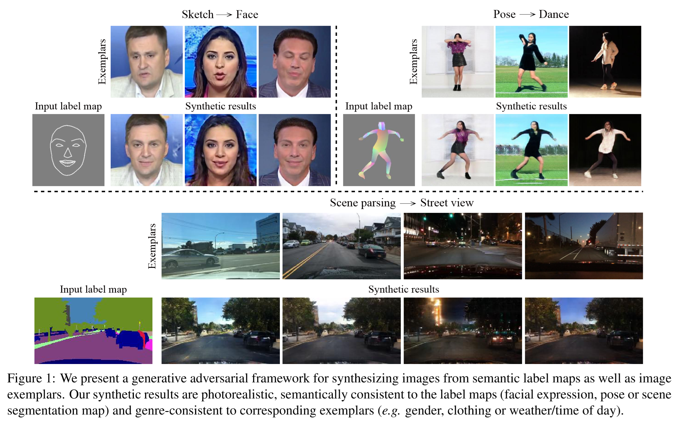
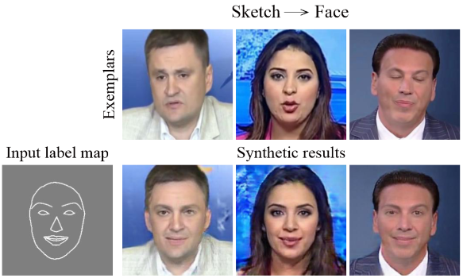
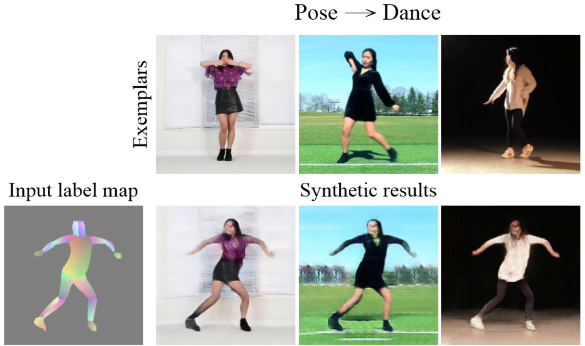
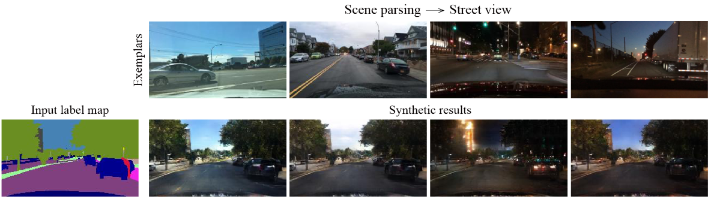
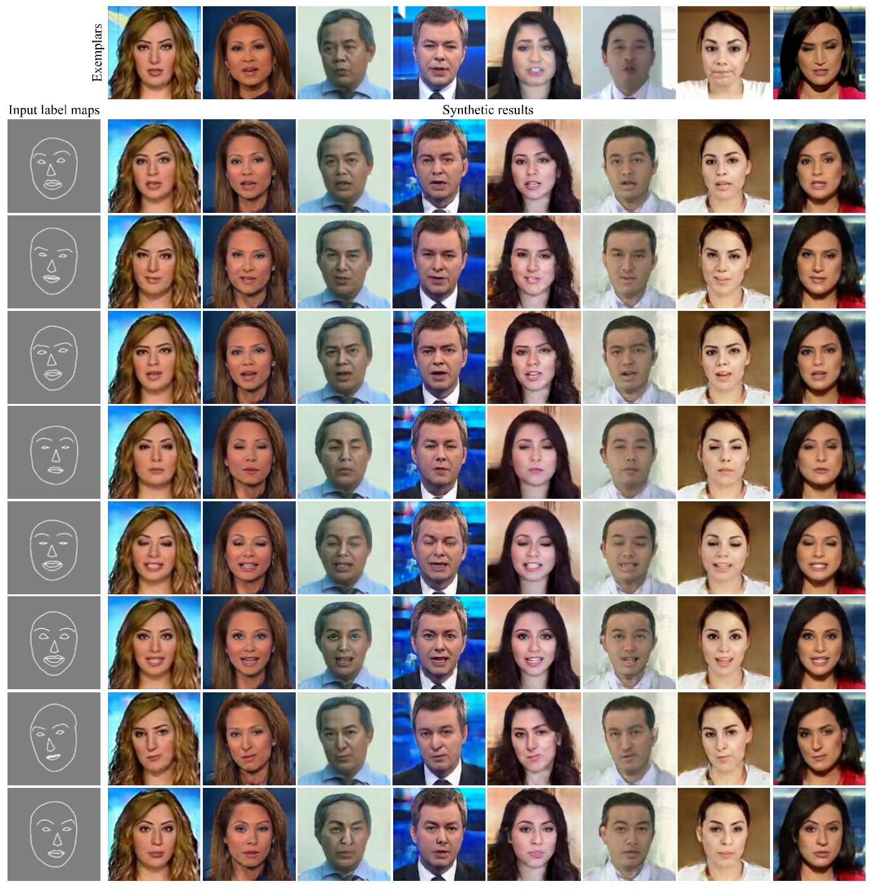
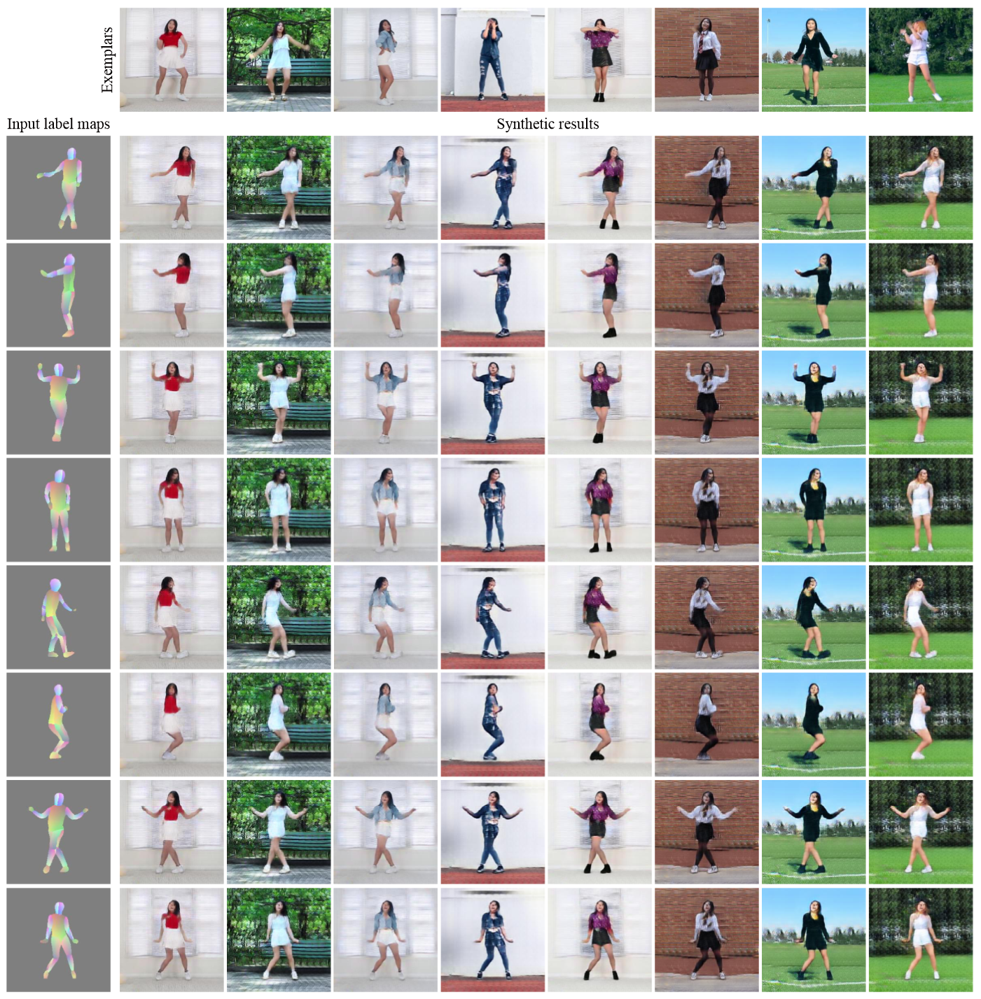
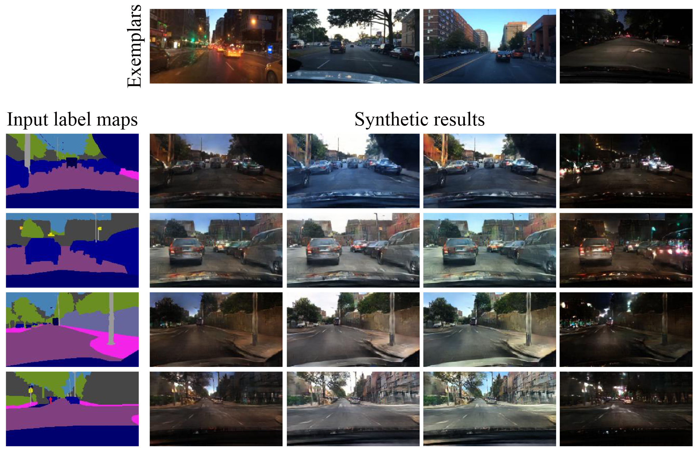

# Example-Guided Style-Consistent Image Synthesis from Semantic Labeling
<p align="center"></p>

## Paper
<a href="">Example-Guided Style-Consistent Image Synthesis from Semantic Labeling</a><br>
Miao Wang<sup>1</sup>, Guo-Ye Yang<sup>2</sup>, Ruilong Li<sup>2</sup>, Run-Ze Liang<sup>2</sup>, Song-Hai Zhang<sup>2</sup>, Peter M. Hall<sup>3</sup> and Shi-Min Hu<sup>2,1</sup><br> 
<sup>1</sup>State Key Laboratory of Virtual Reality Technology and Systems, Beihang University<br>
<sup>2</sup>Department of Computer Science and Technology, Tsinghua University, Beijing<br>
<sup>3</sup>University of Bath<br>
*IEEE Conference on Computer Vision and Pattern Recognition (CVPR), 2019*


## Prerequisites
- Linux
- Python 3
- NVIDIA GPU (12G or 24G memory) + CUDA cuDNN
- pytorch==0.4.1
- numpy
- ...

## Tasks
### Sketch2Face
Task name: face

We use the real videos in the <a href="http://niessnerlab.org/projects/roessler2018faceforensics.html">FaceForensics</a> dataset, which contains 854 videos of reporters broadcasting news. We localize facial landmarks, crop facial regions and resize them to size 256×256. The detected facial landmarks are connected to create face sketches.
<p align="center"></p>

### Pose2Dance
Task name: pose

We download 150 solo dance videos from YouTube, crop out the central body regions and resize them to 256×256. We evenly split each video into the first part and the second part along the time-line, then sample training data only from the first parts and sample testing data only from the second parts of all the videos. The the labels are created  using concatenated pre-trained DensePose and OpenPose pose detection results. 
<p align="center"></p>
  
### SceneParsing2StreetView
Task name: scene

We use the <a href="https://bair.berkeley.edu/blog/2018/05/30/bdd/">BDD100k</a> dataset to synthesize street view images from pixelwise semantic labels (i.e. scene parsing maps). We use the state-of-the-art scene parsing network DANet to create labels.
<p align="center"></p>
  
## Getting Started
### Installation
```bash
git clone [this project]
mkdir FaceForensics
download FaceForensics dataset to FaceForensics/datas
cd Example-Guided-Image-Synthesis
python process.py
mkdir datasets
python generate_data_face_forensics.py --source_path '../FaceForensics/out_data' --target_path './datasets/FaceForensics3/' --same_style_rate 0.3 --neighbor_size 10 --A_repeat_num 50 --copy_data
download data.zip at ../
unzip data.zip
mv ../data/checkpoints Example-Guided-Image-Synthesis/
```

### Training
```bash
new_scripts/train_[Task name].sh
```

### Testing
```bash
new_scripts/test_[Task name].sh
```
## Results
### Face
<p align="center"></p>

### Dance
<p align="center"></p>

### Scene
<p align="center"></p>


## Citation

If you find this useful for your research, please cite the following paper.

```
@InProceedings{pix2pixSC2019,
author = {Wang, Miao and Yang, Guo-Ye and Li, Ruilong and Liang, Run-Ze and Zhang, Song-Hai and Hall, Peter. M and Hu, Shi-Min},
title = {Example-Guided Style-Consistent Image Synthesis from Semantic Labeling},
booktitle = {The IEEE Conference on Computer Vision and Pattern Recognition (CVPR)},
month = {June},
year = {2019}
}
```
